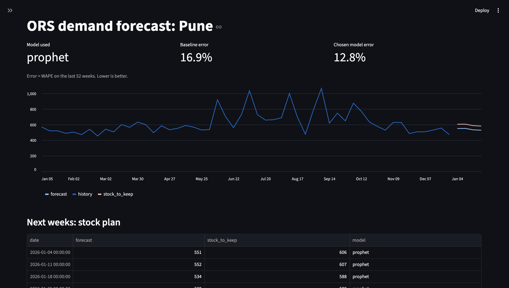

# ORS demand forecasting pipeline

Takes a weekly sales CSV, checks and cleans it, tests a few forecasting models, and gives a 4-week forecast with a stock plan. A small Streamlit dashboard shows the output.

I built this to learn forecasting, so it's rough in places. The demo uses synthetic ORS demand for Pune on top of real weather data (NASA POWER). No real company data is used.

## What the pipeline does

1. **Validate** (`validate_data.py`): reports unreadable dates, missing values, negatives, duplicates and missing weeks. It only stops the run if a required column is missing.
2. **Clean** (`clean_data.py`): removes duplicates, sets negatives to missing, fills gaps of up to 2 weeks, treats zero-sales weeks as possible stock-outs, and replaces values above 4x the rolling median with that median. Every change is flagged in `filled`, `stockout_suspect` and `outlier_check` columns.
3. **Features** (`make_features.py`): past sales and rain/temperature, always lagged by at least the forecast horizon (4 weeks), plus week of year.
4. **Backtest** (`backtest.py`): holds out the last 52 weeks and compares four models by WAPE: baseline (same week last year), naive (value 4 weeks ago), LightGBM and Prophet. Series with fewer than 104 weeks are skipped.
5. **Pick the model** (`backtest.py`): the best model is used only if it beats the baseline by at least 1 point of WAPE, otherwise the baseline is kept.
6. **Forecast** (`forecast.py`): retrains the chosen model on all data, forecasts the next 4 weeks, and adds a safety buffer (default 10%) for `stock_to_keep`.

Outputs are saved in `data/`: `clean_data.csv`, `features.csv`, `backtest_scores.csv`, `backtest_predictions.csv` and `forecast.csv`.

## Run it

Tested on macOS with Python 3.11.

    pip install -r requirements.txt
    python pipeline/run_pipeline.py data/sample_company_data.csv
    streamlit run dashboard/app.py

Run the pipeline first, because the dashboard reads the files it writes.

## Using your own data

Your CSV needs one row per date, product and region. Column names, forecast horizon, test length and weather file are set in `pipeline/config.json`:

    date_column, product_column, region_column, target_column,
    horizon_weeks, test_weeks, weather_file, min_weeks

`weather_file` points to a daily CSV with `date`, `rain_mm` and `temp_c`. The same weather file is used for every region in the data. Setting it to `null` should run the pipeline without weather, but I haven't tested that.

## Results

On the last 52 weeks (WAPE, lower is better), cleaned sample file:

- Prophet: 12.9%
- LightGBM: 15.1%
- Naive: 15.7%
- Baseline (same week last year): 16.9%

On a deliberately messy version of the same data (gaps, 40 duplicate rows, a negative value, stock-out zeros, one value 12x too high), the cleaned result is Prophet 12.8% vs baseline 16.9%.

## What I found

- My first models got 8.4% (LightGBM) and 6.9% (Prophet), but they used rain from 2 and 3 weeks before. That isn't known when forecasting 4 weeks ahead. After using only lags of 4+ weeks the error went up to the numbers above, which are the honest ones. Those first scripts (`scripts/train_lightgbm_v2.py`, `scripts/train_prophet.py`) are still in the repo, so don't compare their scores with the pipeline's.
- On the messy file, one bad outlier pushed every model to roughly 26-44% error until the cleaner replaced it.

## Limits and TODO

- The demand is synthetic and built from the same weather data, so results show the method works, not how real ORS demand behaves.
- Only tested on one product, one region and one test year (2025).
- The weather inputs are past weather, not real weather forecasts.
- The dashboard shows no prediction intervals yet.
- TODO: test on multi-product data, rolling backtest over several years, prediction intervals, real weather forecasts (IMD), monitoring and retraining, keep the original value of fixed outliers in a separate column.

## Folders

- `pipeline/`: the six stages, `run_pipeline.py` and `config.json`
- `dashboard/`: the Streamlit app
- `scripts/`: how the demo data was made (weather download, synthetic demand, messy test file) and my earlier model experiments
- `data/`: demo data and pipeline outputs
- `charts/`: plots

## Notes

Built while learning forecasting (following *Forecasting: Principles and Practice, the Pythonic Way*), with AI help for the code.